# pen

## Introduction

Pen mode is used to draw one character at a time into the canvas, often used for small ascii art creations. It is also very convenient to use it for stencil making. 

This is a feature of the GUI port.

Art examples:


Stencil examples:


## Operations

### Entering and exiting pen mode

| action         | binding       |
|----------------|---------------|
| Enter pen mode | `<<00S-P>>`     |
| Exit pen mode  | `<<Escape>>`    |

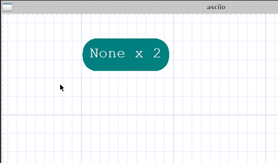

In **pen mode**, The mouse pointer is changed to a text pointer ; '?' is the default character.

### Drawing characters

- Place the mouse where you want to insert a character,  click the `left mouse button` or
the `Enter key`
- hold down the left mouse button and drag to continuously draw characters

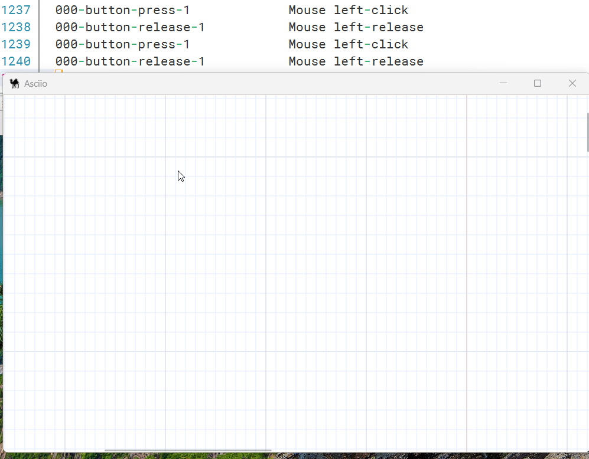

- Press a key on the keyboard to inserted immediately at the current position ; it becomes the default character. 

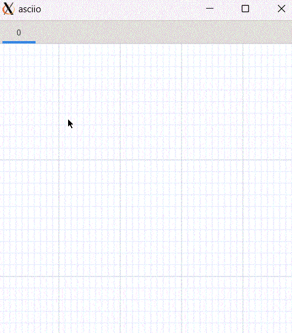

- The cursor' shapes correspond to the next position of the cursor after inputs

| action                     | binding       |
|----------------------------|---------------|
| pen mouse toggle direction | `<<C0S-Tab>>` |

Square :

After inserting a character, the cursor does not move automatically.

Right triangle:

After inserting a character, the cursor automatically moves to the right one position, which can be used for automatic input in the horizontal direction.

Downward triangle :

After inserting a character, the cursor automatically moves down one position, which can be used for automatic input in the vertical direction.

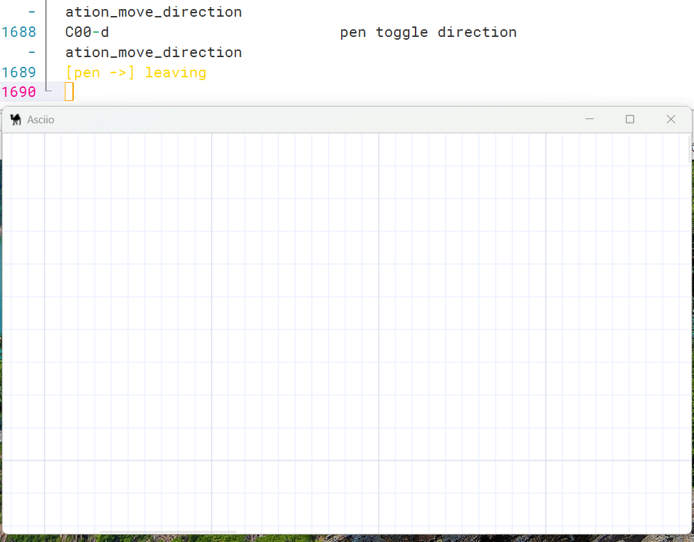

**BackSpace** deletes characters.

 **Shift + Enter** key can wrap lines.

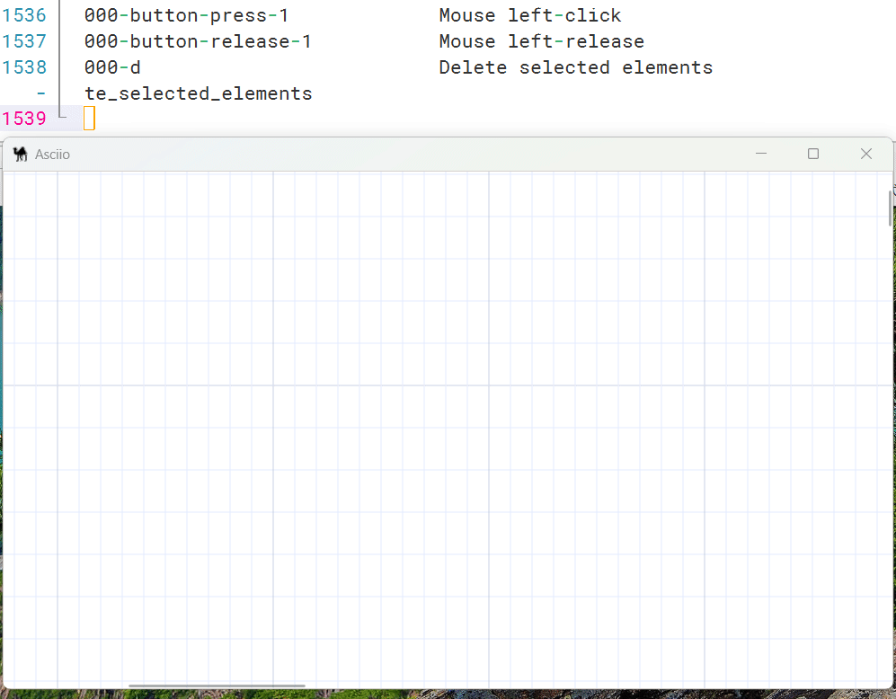

### Fast keyboard-based movement

When drawing ASCII art, you may have to draw many small elements, clicking with the mouse is not be efficient.

Use the keyboard for more efficient input.

Extra bindins (vim-like):

| action                     | binding                     |
|----------------------------|-----------------------------|
| pen mouse move left        | `<<C00-h>>` `<<000-Left>>`  |
| pen mouse move right       | `<<C00-l>>` `<<000-Right>>` |
| pen mouse move up          | `<<C00-k>>` `<<000-up>>`    |
| pen mouse move down        | `<<C0S-j>>` `<<000-Down>>`  |
| pen mouse move left quick  | `<<0A0-h>>`                 |
| pen mouse move right quick | `<<0A0-l>>`                 |
| pen mouse move up quick    | `<<0A0-k>>`                 |
| pen mouse move down quick  | `<<0A0-j>>`                 |
| pen mouse move left tab    | `<<00S-ISO_Left_Tab>>`      |
| pen mouse move right tab   | `<<000-Tab>>`               |

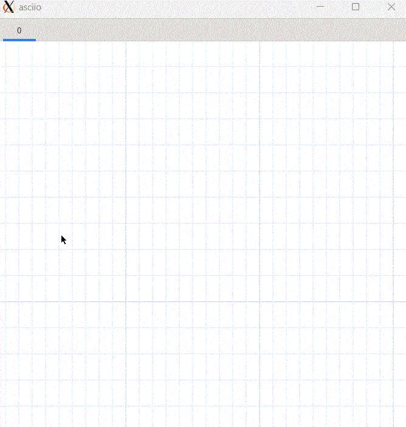


### Character sets

You can type in any ASCIIi characters on the keyboard, you can also declare characters sets in *gui.pl`*.

Character set bindings:

| action                                    | binding         |
|-------------------------------------------|-----------------|
| Switch user-defined character set forward | `<<0A0-Enter>>` |
| Switch user-defined character set back    | `<<C00-Enter>>` |
| Toggle prompt keyboard position           | `<<C0S-Enter>>` |


User-defined character set:

```
# For the mapping of keys to inserted characters in pen mode
	# Unlimited groups can be defined
	# Unmapped keys are inserted according to the keyboard value

PEN_CHARS_SETS => 
	[
		{
		'~' => '─' , '!' => '▀' , '@' => '▁' , '#' => '▂'  , '$' => '▃' , '%' => '▄' ,
		'^' => '▅' , '&' => '▆' , '*' => '▇' , '(' => '█'  , ')' => '▉' , '_' => '▊' ,
		'+' => '▋' , '`' => '▋' , '1' => '▌' , '2' => '▍'  , '3' => '▎' , '4' => '▏' ,
		'5' => '▐' , '6' => '░' , '7' => '▒' , '8' => '▓'  , '9' => '▔' , '0' => 'À' ,
		'-' => '│' , '=' => '┌' , 'Q' => '┐' , 'W' => '└'  , 'E' => '┘' , 'R' => '├' ,
		'T' => '┤' , 'Y' => '┬' , 'U' => '┴' , 'I' => 'Ì'  , 'O' => 'Ð' , 'P' => '┼' ,
		'{' => 'Ã' , '}' => 'Ä' , '|' => 'Â' , 'q' => 'Á'  , 'w' => 'Å' , 'e' => 'Æ' ,
		'r' => 'Ç' , 't' => 'Ò' , 'y' => 'Ó' , 'u' => 'Ô'  , 'i' => 'Õ' , 'o' => 'à' ,
		'p' => 'á' , '[' => 'â' , ']' => 'ã' , '\\' => 'ì' , 'A' => 'ø' , 'S' => 'ù' ,
		'D' => 'ú' , 'F' => 'û' , 'G' => '¢' , 'H' => '£'  , 'J' => '¥' , 'K' => '€' ,
		'L' => '₩' , ':' => '±' , '"' => '×' , 'a' => '÷'  , 's' => 'Þ' , 'd' => '√' ,
		'f' => '§' , 'g' => '¶' , 'h' => '©' , 'j' => '®'  , 'k' => '™' , 'l' => '‡' ,
		';' => '†' , "'" => '‾' , 'Z' => '¯' , 'X' => '˚'  , 'C' => '˙' , 'V' => '˝' ,
		'B' => 'ˇ' , 'N' => 'µ' , 'M' => '∂' , '<' => '≈'  , '>' => '≠' , '?' => '≤' ,
		'z' => '≥' , 'x' => '≡' , 'c' => '─' , 'v' => '│'  , 'b' => '┌' , 'n' => '┐' ,
		'm' => '└' , ',' => '┘' , '.' => '├' , '/' => '┤' ,
		},
		{
		'1' => '┬', '2' => '┴', '3' => '┼',
		},
    ],
```

By default, the keys on the keyboard insert their characters.

After switching  to the user-defined character set, a button prompt panel will show you the mapping,

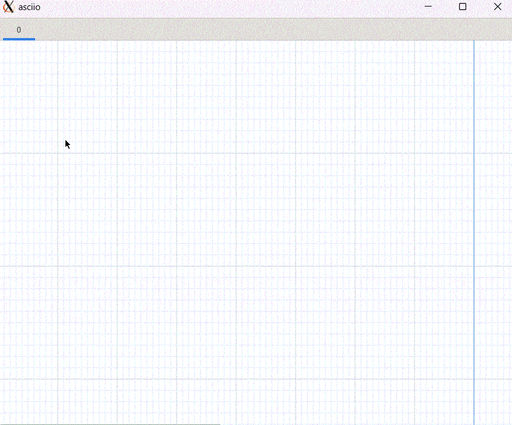

The layout of the prompt keyboard can also be customized. Currently, two
keyboard layouts are supported.

```perl
PEN_KEYBOARD_LAYOUT_NAME => 'US_QWERTY', # US_QWERTY or SWE_QWERTY
```

### Changng the character drawn by the pen

- in pen mode, press the key corresponding to an ASCII
character on the keyboard to switch to that character

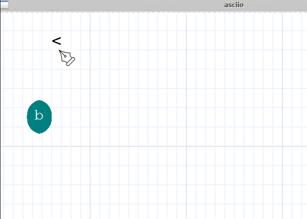

- in pen mode
    - right-clicking an empty space inserts the default character
    - clicking on a character makes the carachter the default character

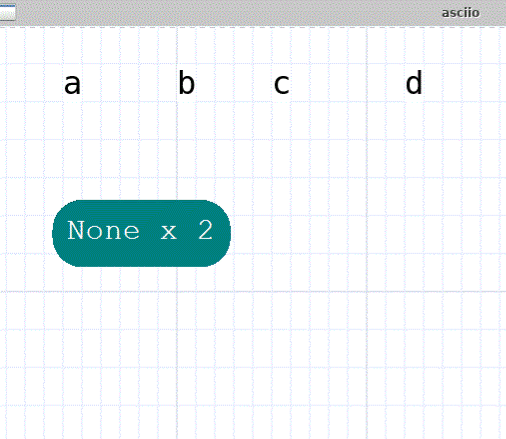

- if the mouse pointer is on a character before entering pen mode, the character becomes the default character.

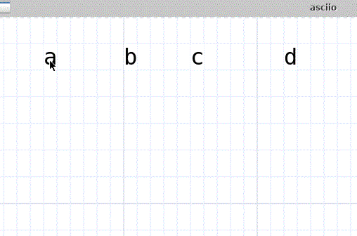

- If elements are selected prior to entering pen mode, those characters will be used, in a loop, as default characters

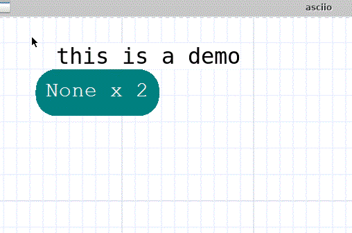


## Sub modes

Pen mode starts in `character drawing` mode.

Binding «Ctl-Tab» switches modes.


### Connector mode

[connector mode](stencils/box_connectors.html#interactive-connector-operations).

### Eraser mode

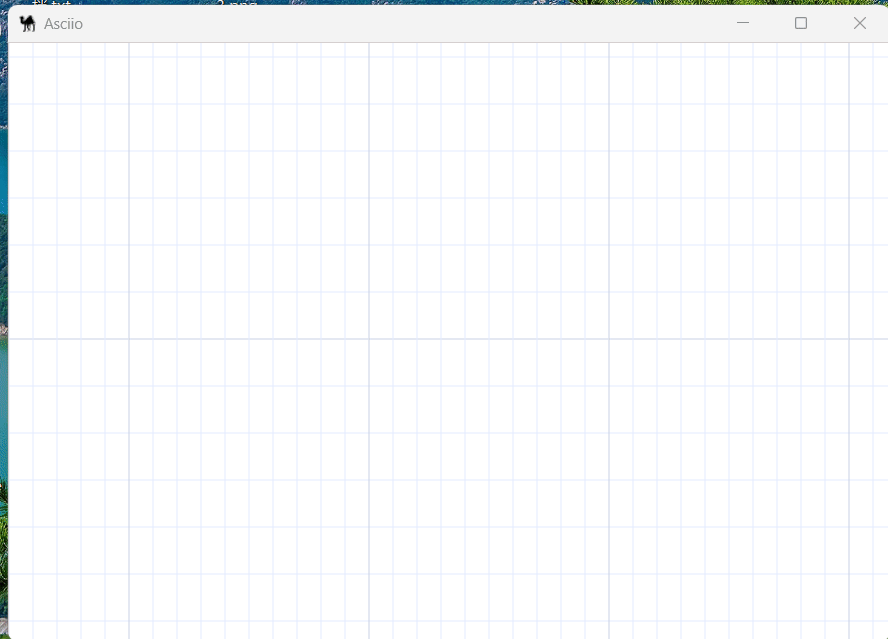

## Deleting characters

There are 3 ways to delete elements in pen mode:
- In character drawing mode
    - place the cursor on the dot element (pen element), and then press the `<<Back Space>>` key.
- In the eraser mode
    - Click the left mouse button directly on elements
    - Click the left mouse button and drag


## Merging ASCII art into a text box

| action                | binding group                 | bingding  |
|-----------------------|-------------------------------|-----------|
| convert to a big text | `<<element leader>>`(`<<e>>`) | `<<S-T>>` |


## Splitting elements into Ascii art

| action                  | binding group                 | bingding  |
|-------------------------|-------------------------------|-----------|
| convert to dots         | `<<element leader>>`(`<<e>>`) | `<<S-D>>` |

This will delete the original elements.

Example: add a nose to the kitten:


