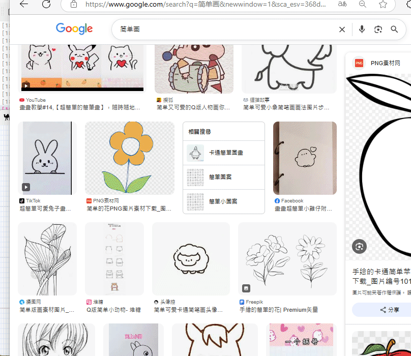
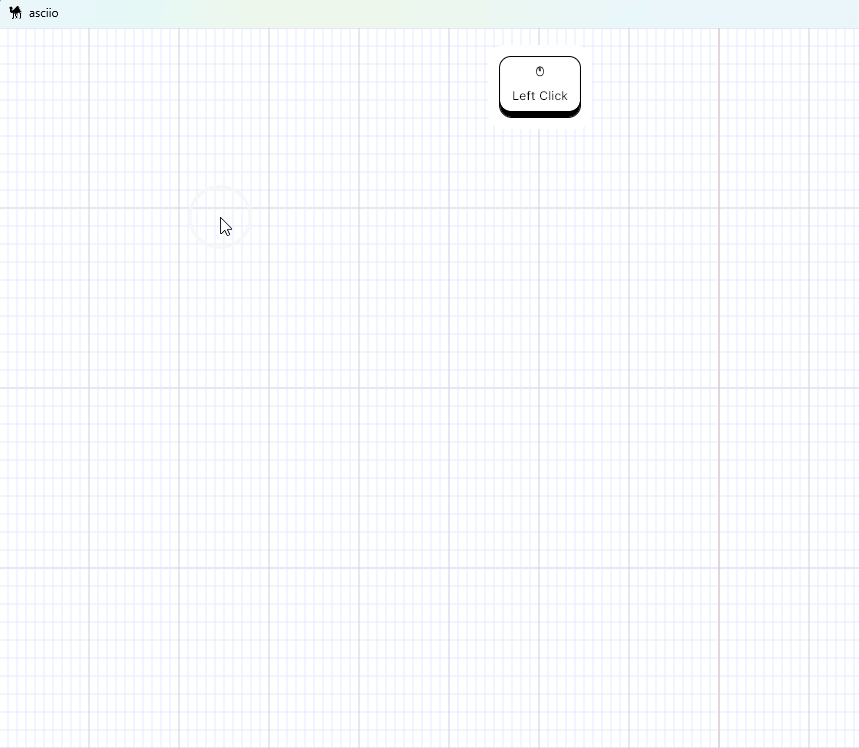
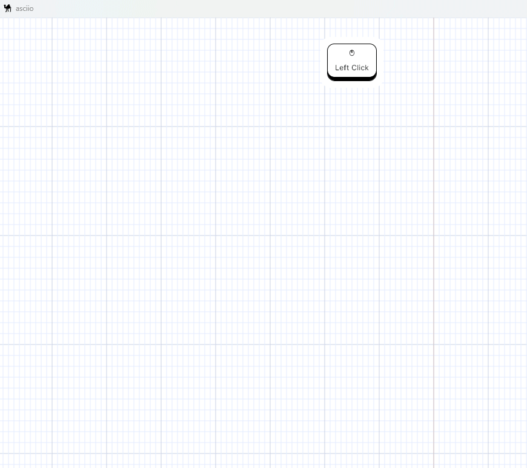
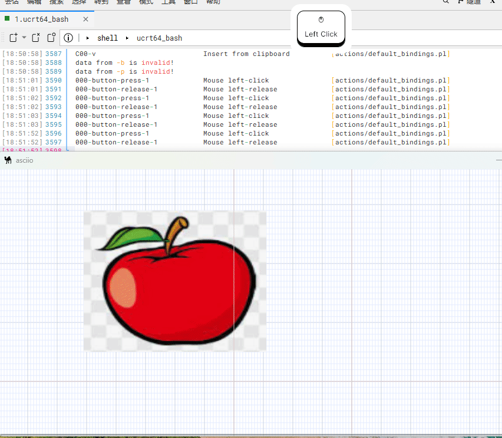
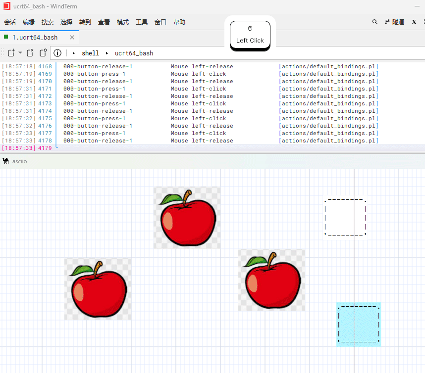
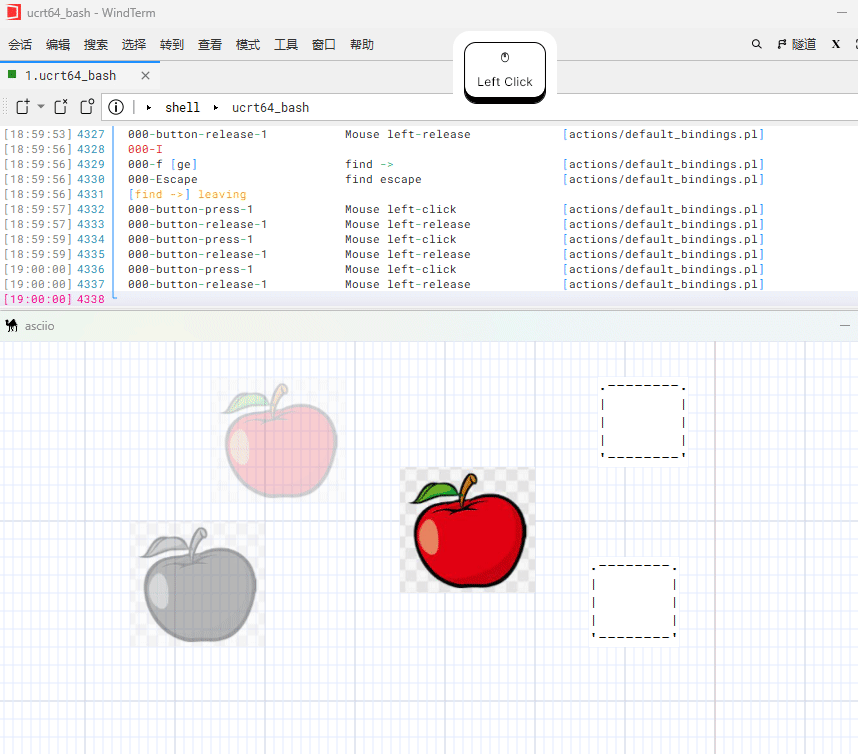

# Asciio image box

Asciio is text-based, and the main purpose of inserting an image box is to make
it a background image.

Image boxes cannot be exported, and only space placeholders are exported. It
has grayscale and transparency settings, making it ideal for use as a
background. In addition, the image box has a frozen attribute, which will be
explained in detail below.



## Create image box

### Create an image box from an image file

| action                       | binding group                 | bingding    |
|------------------------------|-------------------------------|-------------|
| image box inserted from file | `<<element leader>>`(`<<e>>`) | `<<00S-I>>` |



### Copy and paste the image to the canvas via the clipboard

Under `Linux` system, we need to install the `xclip` tool first, and then copy
an image to the clipboard through the following command.

-  If the image is in `PNG` format then use the following command

```bash
xclip -selection clipboard -t image/png -i image.png
```

-  If the image is in `JGEG/JPG` format, then use the following command

```bash
xclip -selection clipboard -t image/jpeg -i image.jpg
```

Under the `Windows` system, we can directly use the system function to copy a
picture.

Then we use `Ctrl+v` directly in the canvas to paste the image into the canvas,
and it will automatically become an image box element.



## Image box related operations

Image boxes, like ordinary boxes, support resizing and moving.



Special operations for image boxes:

| action                        | binding group                 | bingding  |
|-------------------------------|-------------------------------|-----------|
| image box increase gray scale | `<<element leader>>`(`<<e>>`) | `<<g>>`   |
| image box decrease gray scale | `<<element leader>>`(`<<e>>`) | `<<S-G>>` |
| image box increase alpha      | `<<element leader>>`(`<<e>>`) | `<<h>>`   |
| image box decrease alpha      | `<<element leader>>`(`<<e>>`) | `<<S-H>>` |
| image box revert to default   | `<<element leader>>`(`<<e>>`) | `<<o>>`   |

Through these operations, a color image can be turned into an image with
different grayscale and transparency, which is more suitable for existing as
a background.



## element freeze

To make the image box better serve as the background and as a reference image
for our design of ascii art, then it cannot be resized or moved. It cannot
interfere with other elements created on top of it.

Related operation groups about element freezing:

| action                        | binding group                 | bingding  |
|-------------------------------|-------------------------------|-----------|
| enable freeze elements        | `<<element leader>>`(`<<e>>`) | `<<f>>`   |
| disable freeze elements       | `<<element leader>>`(`<<e>>`) | `<<S-F>>` |
| toggle ignore freeze elements | `<<element leader>>`(`<<e>>`) | `<<i>>`   |



When an element is frozen, it cannot be resized or moved. Then you will visually
see a dotted border, indicating that this element is frozen.

If you want adjust the size and position of the frozen element, you need to
temporarily turn off the freezing effect, which is the role of the `<<ei>>`
operation. At this time, the frozen elements will display a green dotted border,
and then we can operate them, cancel their frozen attributes or move and resize
them. After the previous adjustments have been made, we can press `<<ei>>` to
let the freeze continue to take effect.

>Currently only image boxes have properties that can be frozen.

