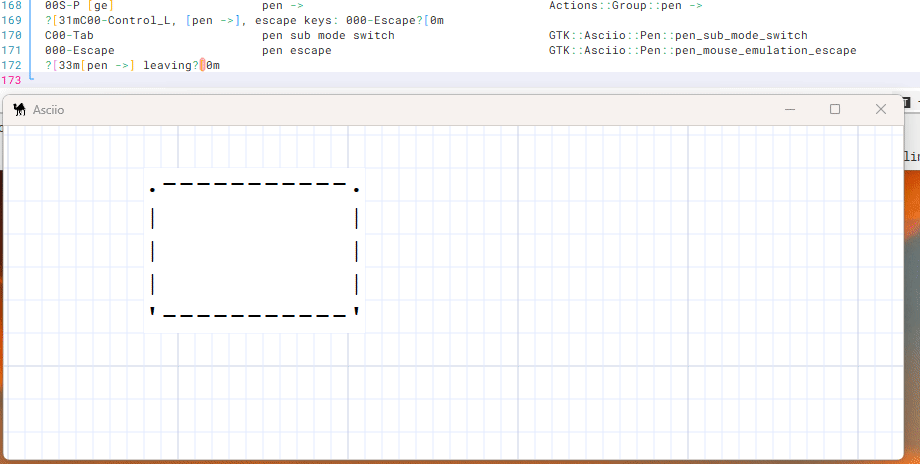

# Element connectors

It is possible to add custom connectors when creating an element stencil, see *setup/Asciio* for the default stencils.

```perl
create_box
	(
	NAME               => 'rabbit paw',
	TEXT_ONLY          => <<'TEXT'
(\_/)
(O.o)
/>
TEXT
,
	RESIZABLE          => 0,
	WITH_FRAME         => 0,
	DEFAULT_CONNECTORS => 0,
	CONNECTORS         => [[2, -1, -1, 2, -1, -1, 'paw']]
	),
```

## CONNECTORS

```perl
[ # An array of connector
	[
	2,      # X coordinate
	-1,     # percentage of width, -1 to disabe
	-1,     # offset added to position if perventage is used
	2,      # Y coordinate
	-1,     # same as above for Y
	-1,     # same as above for Y
	'paw'   # connector name
	],
	[
	# next connector
	...
	],
]
```

The class also has these functions:

- add_connector, dynamically add connector
- remove_connector, by name

## Example


## Interactive Connector Operations

### Adding connectors

- Select a single element
- Enter [pen mode](modes/pen.md) with ***«P»***
- Use `Ctrl + Tab` to switch to `pen connector mode`
- mouse pointer turns to a solid circle
- Move the mouse to where you want to add a connector
- Press the **left** mouse button to add a connector

Connectors can be added up to on character outside the element.



### Removing connectors 

- start with the same steps as "Add connectors" above
- Press the **right* mouse button to delete the connector

Some connectors can't be delete.

- The default 4 connectors of the box element
- Connectors that are connected to another element

